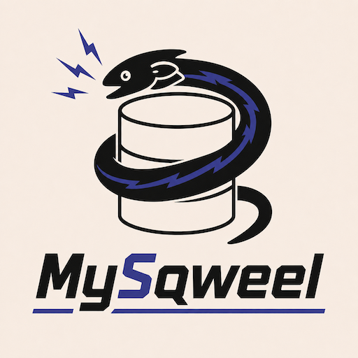

<p align="center">
  
</p>

# MySqweel

**Looks like MySQL. Stores like NoSQL.**

Instead of dropping your dev database every time your schema changes, point your app at MySqweel: it accepts MySQL-flavored commands, stores rows like documents, and gives you fast seeding, resets, and snapshots.

> **Not for production.** MySqweel makes deliberate trade-offs (relaxed uniqueness, advisory foreign keys, partial SQL coverage) that make it fast to iterate with locally and unsafe to use in production.

## Features

- **MySQL wire protocol** — connect with `mysql2`, `Drizzle ORM`, or any other MySQL client, no config changes needed
- **In-memory or file-backed storage** — runs fully in-memory by default; pass `--data-dir` to persist via Lux
- **Schema drift tolerance** — columns can appear or disappear between runs without migrations; drift is tracked and reportable
- **Debug HTTP API** — seed tables, inspect rows, snapshot/restore state, and get drift reports over plain HTTP
- **Interactive REPL** — built-in maintenance shell for drift checks, snapshots, index rebuilds, and ad-hoc SQL
- **Failure injection** — simulate read/write failures and query latency for resilience testing
- **`information_schema` support** — `SHOW TABLES`, `SHOW COLUMNS`, `SHOW CREATE TABLE`, `SHOW INDEX`, and `information_schema.*` views for ORM introspection
- **Rich DML** — `INSERT IGNORE`, `INSERT ... ON DUPLICATE KEY UPDATE`, `REPLACE INTO`, multi-row inserts, parameterized queries

## Installation

**Requirements:** Install the Rust toolchain from [https://rust-lang.org/learn/get-started/](https://rust-lang.org/learn/get-started/) before building or running.

Install from crates.io:

```bash
cargo install my-sqweel
```

This installs the `sqwl` binary.

## Quick Start

Start the server (binds to `127.0.0.1:3307` by default):

```bash
sqwl serve
```

Connect with any MySQL client:

```bash
mysql -h 127.0.0.1 -P 3307 -u root
```

Or with `mysql2` in Node.js:

```js
import mysql from 'mysql2/promise';

const conn = await mysql.createConnection({
  host: '127.0.0.1',
  port: 3307,
  database: 'app',
});

await conn.query('CREATE TABLE users (id BIGINT PRIMARY KEY AUTO_INCREMENT, email VARCHAR(255))');
await conn.query("INSERT INTO users (email) VALUES ('alice@example.com')");
const [rows] = await conn.query('SELECT * FROM users');
console.log(rows);
```

Or with Drizzle ORM:

```js
import { drizzle } from 'drizzle-orm/mysql2';
import mysql from 'mysql2/promise';

const connection = await mysql.createConnection({ host: '127.0.0.1', port: 3307 });
const db = drizzle(connection);
```

## CLI Reference

```
sqwl [options] <command>

Commands:
  serve [--repl]     Start the MySQL server (optionally also open the REPL)
  repl               Open the maintenance REPL without starting the server
  explain <sql>      Parse and explain a SQL statement without executing it
  help               Show this help

Options:
  --bind <addr>              MySQL listen address          (default: 127.0.0.1:3307)
  --data-dir <dir>           Lux-backed persistent storage (default: in-memory)
  --allow-remote             Allow non-loopback bind addresses
  --unique-mode <mode>       overwrite | enforce           (default: overwrite)
  --debug-http               Enable the debug HTTP API
  --debug-bind <addr>        Debug HTTP listen address     (default: bind port + 100)
  --query-delay-ms <n>       Add fixed latency to every statement
  --fail-read-every <n>      Fail every Nth read statement
  --fail-write-every <n>     Fail every Nth write statement
  --snapshot-dir <path>      REPL snapshot directory       (default: .my-sqweel/snapshots)
  --log-filter <filter>      Tracing filter                (default: my_sqweel=info)
```

### Unique modes
Choose how to handle unique constraint collisions in the database.

| Mode | Behaviour |
|------|-----------|
| `overwrite` *(default)* | Duplicate key on insert silently overwrites the existing row — great for seeding |
| `enforce` | Duplicate key raises an error, matching real MySQL behaviour |

## REPL Commands

Open with `sqwl repl` or `sqwl serve --repl`:

```
status                      Print server/engine status as JSON
drift report                Show full schema drift report
drift check                 Return { ok, issueCount, report }
snapshot save <name>        Save current state to a named snapshot file
snapshot restore <name>     Restore a previously saved snapshot
snapshot list               List available snapshots
index rebuild [--all|table] Rebuild indexes for all tables or a single table
reset [table]               Clear all rows, or rows in a single table
explain <sql>               Parse and explain SQL without executing
sql <sql>                   Execute SQL and print results as JSON
quit / exit / Ctrl+C        Exit the REPL
```

## Debug HTTP API

Enable with `--debug-http` (or `--debug-bind <addr>`). By default it binds on `bind port + 100` (e.g. `127.0.0.1:3407`).

| Method | Path | Description |
|--------|------|-------------|
| `GET` | `/tables` | List all tables |
| `GET` | `/tables/:table/rows` | Fetch all rows for a table |
| `POST` | `/tables/:table/seed` | Seed rows into a table (see below) |
| `GET` | `/report` | Schema drift report |
| `GET` | `/snapshot` | Export current state as JSON |
| `POST` | `/restore` | Restore state from a JSON snapshot |

### Seeding rows

The seed endpoint accepts three payload shapes:

```js
// Array of rows (append mode)
fetch('http://127.0.0.1:3407/tables/users/seed', {
  method: 'POST',
  body: JSON.stringify([
    { email: 'alice@example.com' },
    { email: 'bob@example.com', score: 42 },
  ]),
});

// Envelope with explicit mode
fetch('http://127.0.0.1:3407/tables/users/seed', {
  method: 'POST',
  body: JSON.stringify({
    mode: 'replace',   // 'append' | 'replace'
    rows: [{ email: 'carol@example.com' }],
  }),
});
```

Seed calls extend the schema automatically — columns that don't exist yet are added without requiring a migration.

## Schema Drift

MySqweel tracks the "intended" schema (set by `CREATE TABLE` / `ALTER TABLE` statements) separately from the actual data on disk. If rows contain columns that don't match the current schema, or if expected columns are missing, the drift report surfaces those discrepancies.

```bash
# From the REPL
sqwl repl
sqwl> drift check
{
  "ok": true,
  "issueCount": 0,
  "report": { ... }
}
```

This is particularly useful when working with evolving schemas — you can iterate on your table definitions without wiping data, and use the drift report to understand what has changed.

## Storage Modes

| Mode | How to enable | Behaviour |
|------|---------------|-----------|
| In-memory | *(default)* | All data is lost when the process exits |
| Lux-backed | `--data-dir <path>` | State is persisted to a Lux directory with file-locking |

The Lux-backed mode is still development-only. It provides persistence across restarts and is useful for longer-lived local environments, but it is not designed for concurrent multi-process access or production load.

## SQL Support

MySqweel implements a practical subset of MySQL SQL using [`sqlparser`](https://github.com/sqlparser-rs/sqlparser-rs):

**DDL** — `CREATE TABLE`, `DROP TABLE`, `ALTER TABLE` (ADD/DROP/RENAME/MODIFY COLUMN, ADD/DROP INDEX, RENAME TABLE), `CREATE INDEX`, `TRUNCATE`, `CREATE DATABASE`, `DROP DATABASE`

**DML** — `SELECT` (WHERE, JOIN, ORDER BY, LIMIT, GROUP BY, aggregates), `INSERT`, `INSERT IGNORE`, `INSERT ... ON DUPLICATE KEY UPDATE`, `REPLACE INTO`, `UPDATE`, `DELETE`

**Introspection** — `SHOW TABLES`, `SHOW COLUMNS`, `SHOW INDEX`, `SHOW CREATE TABLE`, `SHOW DATABASES`, `information_schema.tables`, `information_schema.columns`, `information_schema.schemata`, `information_schema.table_constraints`, `information_schema.key_column_usage`, `information_schema.referential_constraints`

**Foreign keys** are recorded as advisory metadata (used for `information_schema` queries and ORM introspection) but are **not enforced** at write time.

## Running Tests

```bash
# Rust unit and integration tests
cargo test

# Node.js smoke tests (requires sqwl server running on :3307)
sqwl serve &
npm install
npm run test:mysql2
npm run test:drizzle
npm run test:drizzle:compat
```

The test suite includes MySQL parity tests, schema metadata tests, a compat matrix, and Drizzle ORM compatibility tests.

## Project Layout

```
src/
  bin/sqwl.rs          CLI entry point
  lib.rs               CLI parsing, REPL, and wiring
  model.rs             StoredRow type
  schema/              Schema hint types (ColumnHint, TableSchemaHint, …)
  server/
    mod.rs             Server lifecycle and config
    mysql_wire.rs      MySQL wire protocol handler (msql-srv shim)
    debug_http.rs      Debug HTTP API (axum)
  sql/
    mod.rs             SQL parser wrapper
    engine/
      mod.rs           Engine struct and public API
      ddl.rs           DDL execution (CREATE, ALTER, DROP, …)
      dml.rs           DML execution (INSERT, UPDATE, DELETE, …)
      query.rs         SELECT execution
      eval.rs          Expression evaluation
      values.rs        Value coercion and comparison
      storage_format.rs  Row serialisation
      compat.rs        MySQL compat shims
      maintenance.rs   Snapshots, drift, index rebuild
      tests.rs         Integration tests
  storage/             Lux storage adapter
tests/                 Integration and compat test suites
```

---

## License

MIT
