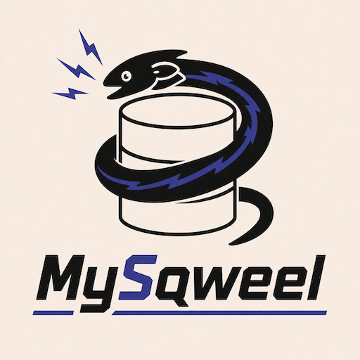

<p align="center">
  
</p>

# MySqweel

<p align="center">
  <strong>Streamlined, embeddable MySQL/MariaDB for applications, testing, and QA.</strong>
</p>

<p align="center">
  <a href="https://github.com/only-cliches/my-sqweel/actions/workflows/ci.yml"></a>
</p>

MySqweel is a lightweight reimplementation of core MariaDB behavior. Embed the engine directly in a
Rust application like SQLite, or expose it through a MariaDB-compatible wire protocol for existing clients,
ORMs, and migration tools. State stays easy to infer, inspect, seed, snapshot, reset, and
deliberately break.

Choose the default drift-tolerant profile for rapid iteration, or enable the strict profile when
compatibility matters more than convenience. The server process can also expose a debug API and a
Meilisearch-shaped search surface.

## At a glance

| Surface | Default | Purpose |
| --- | --- | --- |
| Embedded Rust engine | In process | SQLite-like SQL execution without network or HTTP listeners |
| MariaDB-compatible wire protocol | `127.0.0.1:3307` | Application, ORM, migration, and MariaDB-client connections |
| Debug and search HTTP | `127.0.0.1:3407` | Drift inspection, seeding, snapshots, and local search |
| Storage | In memory | Disposable state; optional locked incremental Lux persistence |
| Compatibility profiles | Drift tolerant / strict | Choose convenience or fail-fast schema behavior |
| MariaDB differential verification | MariaDB 10.11.7 | Differential corpus and exact parity suites |

## Where it fits

MySqweel is useful for:

- embedding streamlined SQL storage directly in Rust applications
- early application development while the schema is changing
- local integration tests that need a disposable MariaDB-compatible endpoint
- test harnesses, QA environments, and deterministic fixtures
- ORM, query-builder, migration, and seed-script development
- realistic UI flows without a full production-shaped stack
- schema-drift inspection and fixture management
- retry, loading, idempotency, and error-path testing
- local text, facet, and vector-search development
- demos, teaching, and experiments

Use real MariaDB when your workload depends on fine-grained locking, full permissions, replication,
optimizer fidelity, security boundaries, high-concurrency durability, scale, or compliance guarantees.

## Embed it

The engine can run entirely in process. This starts no TCP or HTTP listener:

```rust
use my_sqweel::sql::engine::Engine;

fn main() -> anyhow::Result<()> {
    let engine = Engine::default();
    let mut db = engine.session();
    db.execute_sql("CREATE TABLE users (id INT PRIMARY KEY, name TEXT)")?;
    db.execute_sql("BEGIN")?;
    db.execute_sql("INSERT INTO users VALUES (1, 'Ada')")?;
    db.execute_sql("COMMIT")?;

    let results = db.execute_sql("SELECT id, name FROM users")?;
    println!("{:?}", results[0].rows);
    Ok(())
}
```

Use `Engine::default()` for drift-tolerant in-memory storage, or
`Engine::open_with_data_dir(...)` for directory-backed persistence. Create an `Engine::session()`
for each independent caller. Calls directly on `Engine::execute_sql()` share its default session.

## Quick start

### 1. Install from a checkout

You need a recent stable Rust toolchain and Cargo. A MariaDB CLI is optional but useful for the
examples below.

```sh
git clone https://github.com/only-cliches/my-sqweel.git
cd my-sqweel
cargo install --path .
```

The installed binary is `sqwl`. You can also run it from the checkout with:

```sh
cargo run --bin sqwl -- serve
```

### 2. Start the server

```sh
sqwl serve
```

The SQL and HTTP listeners bind to loopback by default:

```text
SQL wire:     127.0.0.1:3307
Debug/search: 127.0.0.1:3407
```

### 3. Connect

```sh
mariadb --protocol=TCP -h 127.0.0.1 -P 3307 -u root app
```

Fresh engines bootstrap the `root` administrator with an empty password and select the `app`
database. Embedders can call `engine.set_admin_credentials()` before accepting connections.
Try a normal schema and query flow:

```sql
CREATE TABLE users (
  id BIGINT PRIMARY KEY AUTO_INCREMENT,
  email VARCHAR(255) NOT NULL UNIQUE,
  display_name VARCHAR(100)
);

INSERT INTO users (email, display_name)
VALUES
  ('ada@example.test', 'Ada'),
  ('grace@example.test', 'Grace');

SELECT id, email, display_name
FROM users
ORDER BY id;
```

Configure your application’s MariaDB driver with host `127.0.0.1`, port `3307`, database `app`,
user `root`, and an empty password. For fail-fast compatibility work, enable the strict profile;
`sqwl help` lists its command-line option.

### Transactions and sessions

```sql
START TRANSACTION;
INSERT INTO users (email, display_name) VALUES ('linus@example.test', 'Linus');
SAVEPOINT before_edit;
UPDATE users SET display_name = 'Temporary' WHERE email = 'linus@example.test';
ROLLBACK TO SAVEPOINT before_edit;
RELEASE SAVEPOINT before_edit;
COMMIT;
```

Statements are atomic, and a failed statement preserves earlier successful work in its transaction.
`ROLLBACK` discards the transaction; disconnecting also rolls it back. `SET autocommit = 0` enables
implicit transactions, and switching back to `1` commits pending work. These are in-memory SQL
guarantees; see [persistent local state](#persistent-local-state) for persistence limits.

The supported isolation level is `REPEATABLE READ`. Snapshots begin at the first read; conflicts
when upgrading an observed snapshot to a writer can return retryable error 1213. Each database
allows one writer at a time, with a five-second acquisition timeout. Plain `SELECT ... FOR UPDATE`
uses that database-wide writer lease. DDL, catalog administration, cross-database SQL, and changing
databases inside a transaction are rejected.

Statement working copies share table rows, indexes, and schema metadata until a write modifies
them. Reads avoid copying every table’s contents, and writes detach the affected data while other
sessions and savepoints retain their snapshots. Parsed query syntax is reused across statements;
query results and session values are not cached. Foreign-key checks try an exact primary-key
lookup first, with a scan fallback for SQL equality and coercion rules.

Bulk inserts avoid repeated parsing by unrelated command handlers and unnecessary copies of
parsed values. INSERT and upsert collect result rows only when `RETURNING` is requested;
transaction persistence remains coordinated at commit.

### Databases and accounts

Logical databases have independent data. The provisioning subset supports `CREATE/DROP DATABASE`,
`CREATE/DROP USER`, database-wide `SELECT`, `INSERT`, `UPDATE`, and `DELETE` grants, and
`REVOKE ALL PRIVILEGES`. Accounts support the `%` host form only. Revocation affects existing
sessions; replacing an account requires fresh authentication. SQL cannot grant administrator status.

`GET_LOCK()` and `RELEASE_LOCK()` provide connection-owned recursive advisory locks. They survive
transaction completion and are released on disconnect.

### Embed the engine and observe query metrics

Library users can subscribe to query lifecycle events. Completion events include logical rows and
cells read, including rows examined but rejected by a predicate, plus physical row and cell writes:

```rust
use my_sqweel::sql::engine::{Engine, QueryEvent, QueryEventOptions};

let engine = Engine::default();
let events = engine.subscribe_query_events(QueryEventOptions::metadata_only());
engine.execute_sql("SELECT id FROM users WHERE email LIKE '%example.test'")?;

let _received = events.recv()?;
if let QueryEvent::Completed(event) = events.recv()? {
    println!("rows read: {}", event.metrics.rows_read);
    println!("cells read: {}", event.metrics.cells_read);
}
```

These are logical execution metrics, not storage-I/O counters. Repeated join or subquery
examinations count repeatedly, and multi-statement API calls report aggregate totals. These events
are diagnostics, not commit notifications: a completed statement can still be rolled back.

## Choose a compatibility profile

MySqweel has two intentionally different compatibility profiles.

| Behavior | Drift tolerant (default) | Strict |
| --- | --- | --- |
| Missing tables or columns during writes | Infer and extend schema hints | Return an error |
| Repeated `CREATE TABLE` | Merge new hints into known metadata | Use MariaDB-style exists behavior |
| Declared types, ranges, lengths, nulls, and defaults | Best-effort coercion | Validate and reject invalid values |
| Unique conflicts | Overwrite by default; configurable | Enforce uniqueness |
| Foreign keys | Enforce declared relationships and actions | Enforce relationships with MariaDB-style errors |
| Best use | Embedded apps, prototypes, fixtures, changing DTOs | Application integration, ORMs, migrations, and compatibility tests |

Strict mode also returns common MariaDB wire error numbers for missing tables and columns, duplicate
entries, null/default violations, invalid values, length/range errors, and foreign-key failures.

Strict mode narrows accidental differences; it does not turn MySqweel into MariaDB. Both profiles use
the same supported SQL and transaction surface.

### Unique conflicts without full strict mode

The drift profile can enforce unique keys while retaining schema inference:

```sh
sqwl --unique-mode enforce serve
```

The default is `--unique-mode overwrite`, which is convenient for repeatable seeds. The strict
profile always enforces unique keys.

## CLI reference

```text
sqwl [options] serve [--repl]
sqwl [options] repl
sqwl explain <sql>
sqwl help
```

Global options in the table below must appear before the subcommand. Use `sqwl help` for the full
option list, including the strict compatibility profile.

| Option | Purpose |
| --- | --- |
| `--bind <addr>` | SQL bind address; default `127.0.0.1:3307` |
| `--debug-bind <addr>` | Debug/search HTTP bind; default is the SQL port plus 100 |
| `--default-time-zone <offset>` | Initial timezone for new SQL sessions, such as `-10:00`; default `+00:00` |
| `--data-dir <dir>` | Enable locked incremental Lux persistence |
| `--allow-remote` | Permit non-loopback SQL and HTTP bindings |
| `--unique-mode <mode>` | Choose `overwrite` or `enforce`; default `overwrite` |
| `--query-delay-ms <n>` | Add fixed latency to each SQL statement |
| `--fail-read-every <n>` | Fail every Nth read statement |
| `--fail-write-every <n>` | Fail every Nth write statement |
| `--snapshot-dir <path>` | REPL snapshot directory; default `.my-sqweel/snapshots` |
| `--log-filter <filter>` | Tracing filter; default `my_sqweel=info` |

The debug/search API is always enabled for `sqwl serve`. `--allow-remote` can expose unauthenticated,
state-mutating HTTP endpoints; never bind MySqweel to an untrusted network.

### Explain SQL without executing it

```sh
sqwl explain "SELECT id, email FROM users WHERE email = 'ada@example.test'"
```

Example output:

```json
{
  "count": 1,
  "statements": [
    {
      "kind": "query",
      "tables": ["users"],
      "normalized": "SELECT id, email FROM users WHERE email = 'ada@example.test'"
    }
  ]
}
```

## Local-data workflows

### Persistent local state

Without `--data-dir`, state lives in memory and disappears with the process. To reuse a local
database between runs:

```sh
sqwl --data-dir .my-sqweel/data serve
```

The directory is locked against concurrent opens. The embedded Lux store persists all logical
databases and the account catalog. A successful SQL operation writes changed rows, schemas,
auto-increment counters, views, and index comments, then publishes the new in-memory SQL state.
Unchanged databases and shared, unmodified tables are skipped; a commit no longer serializes
the entire server into one image.

Statement atomicity and session isolation apply to the running engine. Persistence does **not**
promise crash-atomic multi-key commits or synchronous durability. A storage batch can partially
apply before a command or I/O error. On failure, the engine retains the previous visible SQL state
and refuses further operations until reopen; reopening does not guarantee an all-or-nothing
transaction recovery.

The version-2 storage layout rejects legacy `transaction-image.json` files, nonempty unversioned
Lux stores, and unsupported storage versions with reset guidance. There is no migration path for
old development data. On Unix, the data directory is restricted to its owner.

Writes can still copy an entire affected table, and persistence compares rows within changed
tables linearly. Large single-table write workloads therefore remain costly; this is intended for
development datasets. Embedded users can open, use, and close persistent engines inside an
existing Tokio runtime.

### Maintenance REPL

Run the server and maintenance shell together:

```sh
sqwl serve --repl
```

Or open only the REPL, optionally against an existing data directory:

```sh
sqwl --data-dir .my-sqweel/data repl
```

Common commands:

```text
status
drift check
drift report
snapshot save <name>
snapshot restore <name>
snapshot list
index rebuild [--all|<table>]
reset [table]
explain <sql>
sql <sql>
help
quit
```

### Inspect schema drift

The drift report compares declared schema hints with stored rows:

```sh
curl http://127.0.0.1:3407/_drift/report
```

It reports known tables, row counts, declared columns, missing row fields, extra fields, and
duplicate values for unique constraints.

### Seed JSON directly

```sh
curl -X POST http://127.0.0.1:3407/_drift/tables/users/seed \
  -H 'content-type: application/json' \
  -d '{
    "mode": "replace",
    "rows": [
      {
        "email": "ada@example.test",
        "display_name": "Ada Lovelace",
        "role": "admin"
      },
      {
        "email": "grace@example.test",
        "display_name": "Grace Hopper",
        "role": "engineer"
      }
    ]
  }'
```

In the drift profile, the seed endpoint can infer a missing table and columns from the payload.

### Save and restore snapshots

The REPL stores named snapshots under `--snapshot-dir`:

```text
snapshot save before-auth-refactor
reset users
snapshot restore before-auth-refactor
```

Snapshots cover the default `app` database, excluding other databases and the account catalog.
They are separate from the incremental Lux store, which also includes other databases and accounts. The HTTP API can also export and restore these snapshots:

```sh
curl -X POST http://127.0.0.1:3407/_drift/snapshot
```

### Inject failures

Add latency or deterministic read/write failures:

```sh
sqwl \
  --query-delay-ms 100 \
  --fail-read-every 10 \
  --fail-write-every 7 \
  serve
```

This is useful for testing retries, loading states, error handling, idempotency, and unhappy-path
user experiences.

## MariaDB compatibility

MySqweel implements a practical, tested MariaDB subset. Unsupported syntax returns an explicit error
instead of being silently evaluated as `NULL`, `FALSE`, or a partial result.

### Verification contract

Compatibility verification targets pinned **MariaDB 10.11.7**. Differential corpus, exact parity,
error-code, prepared-statement, and ORM-shaped suites exercise the supported surface. The results
below predate the current storage, execution, command-dispatch, metadata, and wire-listener
changes; they do not qualify the current working tree.

- The previous local focused upstream audit passed **25/25 complete files**, containing **339 direct
  SQL statements**, against both MariaDB and MySqweel, with zero infrastructure failures. The
  hash-pinned scope is [`tests/mariadb-mtr-scope.txt`](tests/mariadb-mtr-scope.txt).
- The scope includes `innodb/innodb_bug57255`: 18 statements exercising a transaction with 743
  inserted rows and cascading deletes. Rust tests cover rollback, savepoints, autocommit,
  session isolation, wire status, account persistence, and recovery.
- The previous strict-manifest run passed **32/32 files / 381 statements** locally against both MariaDB 10.11.7
  and the transactional MySqweel backend, with zero infrastructure failures.
  Focused cases remain audit-only until CI qualification and promotion into
  [`tests/mariadb-mtr-allowlist.txt`](tests/mariadb-mtr-allowlist.txt).
- The [discovery workflow](.github/workflows/mariadb-mtr-discovery.yml) inventories **5,585 files**,
  identifying **319 candidates / 20,082 direct and sourced statements**. Candidates are not passing
  tests or a compatibility score; each must pass both engines before promotion.

The external MTR runner’s startup probe is adapted to run `SHOW VARIABLES` in the configured
database. Both engines receive the same adaptation, with original and adapted runner hashes
recorded in `mariadb-test-run.json`. Upstream test files, expected results, and the test client
binary remain unchanged.

Percentages describe only their versioned test scope, not the entire MariaDB grammar. Every
reported edge case should become a regression case before its implementation is changed.

### Schema, DDL, and metadata

- `CREATE TABLE` and `CREATE TEMPORARY TABLE`
- primary, unique, secondary, prefix, and foreign-key metadata
- virtual and stored generated columns
- `ALTER TABLE` add, drop, rename, change, and modify column forms
- column defaults, types, nullability, `FIRST`, and `AFTER`
- `CREATE INDEX`, `CREATE OR REPLACE INDEX`, prefix indexes, `DROP INDEX IF EXISTS`, and `ALTER TABLE ... DROP INDEX`
- `DROP TABLE`, `TRUNCATE TABLE`, and `RENAME TABLE`
- foreign-key validation and `CASCADE`, `SET NULL`, `RESTRICT`, and `NO ACTION`
- `SHOW TABLES`, `SHOW COLUMNS`, `SHOW INDEX`, `SHOW CREATE TABLE`, and `DESCRIBE`
- common `information_schema` views used by clients and ORMs

Column introspection with a literal `table_name = '...'` filter builds metadata only for that
table, including when the condition is combined with `AND`. The full filter still runs; `OR`
and row-dependent expressions retain ordinary evaluation.

### Writes

- `INSERT ... VALUES` and `INSERT ... SELECT`
- `INSERT IGNORE`, `REPLACE`, and `ON DUPLICATE KEY UPDATE`
- `UPDATE`, including common joined-update forms
- single-table deletes with ordering/limits and MariaDB multi-table delete forms
- `RETURNING` for inserts, updates, and deletes
- auto-increment keys, defaults, generated values, type coercion, and affected-row counts

### Queries

- `SELECT`, `DISTINCT`, aliases, qualified wildcards, and expression projections
- `WHERE`, `GROUP BY`, `HAVING`, `ORDER BY`, `LIMIT`, and `OFFSET`
- aggregate, scalar, date/time, JSON, string, numeric, and conversion functions
- broad JSON document functions, JSON aggregates, wildcard paths, arrow extraction, and basic `JSON_TABLE` projections
- `INNER`, `LEFT`, `RIGHT`, `CROSS`, `NATURAL`, `ON`, and `USING` joins
- derived tables and CTEs with column aliases, including supported recursive `UNION` forms
- scalar and `EXISTS`/`IN` subqueries
- `UNION`, `INTERSECT`, and `EXCEPT`, including `ALL`/`DISTINCT` variants
- named/inline windows, common `ROWS` frames, and peer-aware `RANGE` behavior
- `ROW_NUMBER`, `RANK`, `DENSE_RANK`, `PERCENT_RANK`, `CUME_DIST`, `NTILE`, `LAG`, `LEAD`,
  `FIRST_VALUE`, `LAST_VALUE`, `NTH_VALUE`, and aggregate windows
- MariaDB-style three-valued logic, numeric-prefix coercion, and byte/character length behavior

See [CHANGELOG.md](CHANGELOG.md) for the detailed function and compatibility history.

### Wire and client behavior

New connections wake the SQL listener through socket readiness, avoiding the previous 50 ms
accept-polling delay. `WireServer::serve_listener_until()` remains a blocking API; it can run from
inside a Tokio runtime and releases its listener when stopped.

`VERSION()` and version-variable defaults report `8.0.0-my-sqweel`.

- prepared statements and positional parameters
- declared/inferred result types and nullability
- signed/unsigned numeric widths, decimal scale, and source-table metadata
- typed `DATE`, `DATETIME`, `TIMESTAMP`, and signed fractional `TIME` values
- JSON and binary result metadata
- `LAST_INSERT_ID()`, `DATABASE()`, `SCHEMA()`, and common session variables
- charset, collation, and compatibility system-metadata stubs
- connection-owned settings, `SET NAMES`, and transaction status and warning counts in result packets
- native-password authentication; unsupported connection-reset and change-user commands fail explicitly

### Explicit limits

The following are outside the supported compatibility surface:

- isolation levels other than `REPEATABLE READ`, fine-grained row locks, and XA transactions
- unrestricted recursive CTE support
- `FULL JOIN`
- stored procedures, stored functions, triggers, and events
- replication, the full account/permissions system, and production security guarantees
- exact optimizer, index-planning, collation, and locking behavior
- the remainder of the MariaDB grammar not listed above
- `JSON_VALUE` optional `RETURNING`/`ON EMPTY`/`ON ERROR` clauses (the pinned sqlparser version rejects those forms before execution)
- nested `JSON_TABLE` column expansion and binary-JSON storage byte-for-byte accounting
- the complete JSON Schema keyword vocabulary; the embedded validator currently covers the common structural/type constraints

Use real MariaDB for tests that depend on any of these behaviors.

## Meilisearch-shaped local search

The debug HTTP listener also provides a local API shaped like Meilisearch. SQL tables remain the
source of truth; document mutations update table rows and rebuild the derived Tantivy search index.
HTTP maintenance and search operate on committed state in the default `app` database. They are
trusted administrative surfaces: SQL account authentication and grants do not protect HTTP callers.

Create an index and add documents:

```sh
curl -X POST http://127.0.0.1:3407/indexes \
  -H 'content-type: application/json' \
  -d '{ "uid": "books", "primaryKey": "id" }'

curl -X POST http://127.0.0.1:3407/indexes/books/documents \
  -H 'content-type: application/json' \
  -d '{
    "documents": [
      {
        "id": "1",
        "title": "Dune",
        "genre": "sci-fi",
        "rating": 10,
        "description": "Desert planet politics, spice, prophecy, and power."
      },
      {
        "id": "2",
        "title": "Foundation",
        "genre": "sci-fi",
        "rating": 8,
        "description": "Mathematics, empire, and a long plan."
      }
    ]
  }'
```

Search:

```sh
curl -X POST http://127.0.0.1:3407/indexes/books/search \
  -H 'content-type: application/json' \
  -d '{
    "q": "desert spice",
    "filter": "genre = \"sci-fi\"",
    "sort": ["rating:desc"],
    "attributesToRetrieve": ["id", "title", "rating"],
    "showRankingScore": true
  }'
```

The development compatibility surface includes document CRUD, filters, sorting, facets, facet
search, multi-search, settings, task-shaped responses, stats, dumps, webhooks, and API-key stubs.
Official Meilisearch JavaScript-client flows are covered by tests; Python client coverage is
available when its optional dependency is installed.

This is not a complete Meilisearch implementation. Authentication is permissive/stubbed, task
execution is local, and relevance is not guaranteed to match a production Meilisearch server.

### Vector search

Declare a vector column:

```sql
CREATE TABLE books (
  id TEXT PRIMARY KEY,
  title TEXT,
  embedding VECTOR(3)
);
```

Add vectors through the document endpoint, then search with a query vector:

```sh
curl -X POST http://127.0.0.1:3407/indexes/books/search \
  -H 'content-type: application/json' \
  -d '{
    "vector": [0.95, 0.05, 0.2],
    "vectorField": "embedding",
    "showRankingScore": true
  }'
```

Local vector ranking uses cosine similarity.

## HTTP endpoint map

| Endpoint | Purpose |
| --- | --- |
| `GET /health` | Basic process health |
| `GET /version` | Version payload |
| `GET /_drift/health` | Drift API health |
| `GET /_drift/report` | Schema-drift report |
| `GET /_drift/tables` | Known tables |
| `GET /_drift/tables/{table}/rows` | Inspect table rows |
| `POST /_drift/tables/{table}/seed` | Seed JSON rows |
| `POST /_drift/snapshot` | Export an engine snapshot |
| `POST /_drift/restore` | Restore an engine snapshot |
| `GET/POST /indexes` | List or create search indexes |
| `POST /indexes/{uid}/documents` | Add or update documents |
| `POST /indexes/{uid}/search` | Search an index |
| `POST /indexes/{uid}/facet-search` | Search facet values |
| `POST /multi-search` | Run multiple searches |
| `GET /tasks` | List task-shaped responses |
| `GET /stats` | Instance statistics |

Additional Meilisearch-shaped routes cover per-index settings and stats, document fetch/delete,
index swaps, dumps, webhooks, and keys.

## Development

Run the complete local suite:

```sh
cargo test --all-targets --locked
```

Before pushing, run the same fail-closed entry point used by CI's MariaDB feature job:

```sh
tools/prepush.sh
```

The pre-push check requires either `MARIADB_COMPARE_URL` or a working Docker daemon. When Docker is
used, it pulls and provisions the pinned `mariadb:10.11.7` image, shares that server across the suite,
and removes it afterward. Unlike the default local suite, this command fails instead of silently
skipping differential tests when MariaDB is unavailable.

Enable the checked-in Git hook once per clone to run it automatically before every push:

```sh
git config core.hooksPath .githooks
```

When Docker and a local MariaDB image are available, compatibility tests provision and
remove their own comparison server. To use an existing instance, set `MARIADB_COMPARE_URL` to its
driver connection URL. Require comparison with:

```sh
MARIADB_PARITY_REQUIRED=1 \
cargo test --all-targets --locked
```

On macOS or another Docker host, run the pinned MariaDB 10.11.7 MTR baseline in isolated ARM64
containers with:

```sh
tools/run_mariadb_mtr_baseline_docker.sh
```

The script provisions and removes its own MariaDB container and Docker network. It caches the
downloaded Ubuntu MTR packages under `.cache/mariadb-mtr` and writes the report to
`artifacts/mariadb-mtr-baseline/mtr-report.md`. Intel Macs can use the same command through Docker's
ARM64 emulation, although it will be slower than Apple Silicon.

On an Ubuntu 24.04 ARM64 runner, reproduce the upstream MariaDB MTR comparison with the pinned
Ubuntu MariaDB packages. Set `MARIADB_COMPARE_URL` to a reachable disposable MariaDB 10.11.7
instance’s driver connection URL first; the runner resets test databases:

```sh
eval "$(tools/prepare_mariadb_mtr.sh .cache/mariadb-mtr --print-env)"
export PATH="$MTR_BINDIR/bin:$PATH"
cargo build --locked --bin sqwl
python3 tools/mariadb_mtr_compat.py \
  --target both \
  --suite-root "$MARIADB_MTR_ROOT" \
  --allowlist tests/mariadb-mtr-allowlist.txt \
  --baseline-url "$MARIADB_COMPARE_URL" \
  --mtr-runner "$MTR_RUNNER" \
  --safe-process-bin "$MTR_SAFE_PROCESS" \
  --mtr-layout mariadb \
  --baseline-label MariaDB \
  --mysqweel-bin target/debug/sqwl \
  --report-dir artifacts/mariadb-mtr \
  --baseline-version 10.11.7 \
  --source-revision 10.11.7-2ubuntu2 \
  --minimum-percent 100
```

To reproduce the focused transaction-inclusive audit, replace the allowlist with
`tests/mariadb-mtr-scope.txt` and use `--report-dir artifacts/mariadb-mtr-focused`. The runner starts
the local MySqweel binary automatically for `--target both`.

Formatting and linting:

```sh
cargo fmt --all --check
cargo clippy --all-targets --all-features
```

Run from the checkout with debug logs:

```sh
cargo run --bin sqwl -- --log-filter my_sqweel=debug serve --repl
```

When fixing a compatibility mismatch, add the smallest reproducing query to the differential
corpus or parity suite first. A useful report includes the schema, fixture rows, query, MariaDB
version, expected result, and MySqweel result.

## Project layout

```text
src/bin/sqwl.rs                    CLI entrypoint
src/lib.rs                         CLI, REPL, snapshots, and SQL explain
src/server/                        SQL wire protocol and administrative HTTP APIs
src/sql/mod.rs                     SQL parsing
src/sql/engine/                    SQL execution and compatibility validation
src/sql/engine/transaction.rs      Sessions, transactions, and commit publication
src/sql/engine/catalog.rs          Database catalog, accounts, and authorization
src/schema/mod.rs                  Schema-hint model
src/model.rs                       Stored-row model
src/sql/engine/transaction/persistence.rs  Incremental committed-state persistence
src/storage/mod.rs                 Embedded Lux storage, locking, and runtime lifecycle
vendor/msql-srv/                   Vendored wire-server dependency
tests/                            Engine, transaction, wire, ORM, and parity suites
tests/mariadb-mtr-scope.txt         Focused upstream audit manifest
tests/mariadb-mtr-allowlist.txt     Strict upstream gate manifest
```

## License

[MIT](LICENSE)
