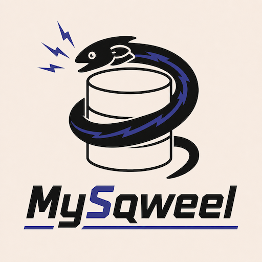

<p align="center">
  
</p>

# MySqweel

**Embed SQL in a Rust application. Connect MySQL and MariaDB clients to the same database.**

[](https://github.com/only-cliches/my-sqweel/actions/workflows/ci.yml)

MySqweel is a Rust SQL engine for application development, integration tests,
and local data. Create one `Engine`, choose memory or RocksDB storage, and run
queries directly through synchronous or asynchronous calls. When you need
network access, spawn SQL endpoints from that engine, each with its own
authentication and database or table restrictions.

Embedded callers and connected clients share the same data. Engine clones
share ownership; sessions hold connection state; endpoint handles control
listeners. You can start and stop endpoints while the engine keeps running.

[Library guide](docs/README.md) · [SQL endpoints](docs/server.md) ·
[Compatibility](#mariadb-compatibility) · [Changelog](CHANGELOG.md)

## Start with an Engine

With this repository checked out at `../my-sqweel`, add these dependencies to
your application:

```toml
[dependencies]
my-sqweel = { path = "../my-sqweel" }
anyhow = "1"
serde_json = "1"
```

This example creates an in-memory database, writes a row, and reads it back:

```rust
use my_sqweel::Engine;
use serde_json::json;

fn main() -> anyhow::Result<()> {
    let engine = Engine::default();
    engine.execute_sql(
        "CREATE TABLE tasks (id INT PRIMARY KEY, title TEXT NOT NULL, done BOOLEAN DEFAULT false)"
    )?;
    engine.execute_sql_with_params(
        "INSERT INTO tasks (id, title) VALUES (?, ?)",
        &[json!(1), json!("Try MySqweel")],
    )?;

    let results = engine.execute_sql("SELECT title, done FROM tasks WHERE id = 1")?;
    assert_eq!(results[0].rows[0]["title"], json!("Try MySqweel"));
    assert_eq!(results[0].rows[0]["done"], json!(false));
    Ok(())
}
```

Creating an engine starts no network listeners. SQL schemas are strict:
declare tables and columns before writing, and values must satisfy their
types and constraints. The initial database is `app`.

Query calls return one `QueryResult` per SQL statement, including JSON-object
rows, column metadata, affected-row counts, the last insert ID, and warnings.
Use parameterized queries for values supplied by an application.

### Async calls on the same engine

`Engine` and `EngineSession` both provide `_async` query methods for use
inside a Tokio runtime. Async parameter calls take an owned `Vec<Value>`:

```rust,no_run
use my_sqweel::Engine;
use serde_json::json;

async fn finish_task(engine: &Engine, id: i64) -> anyhow::Result<()> {
    engine.execute_sql_with_params_async(
        "UPDATE tasks SET done = true WHERE id = ?",
        vec![json!(id)],
    ).await?;
    Ok(())
}
```

Use `Engine::open_async(config, storage).await` when opening storage from an
async application. Both query styles use the same storage, filters, and
transaction behavior.

## Choose storage once

The storage backend belongs to the engine and serves all of its sessions
and endpoints.

| Backend | Open with |
| --- | --- |
| In memory | `Engine::default()` or `Storage::Memory` |
| RocksDB directory | `Storage::RocksDb(path)` |
| Application-provided storage | `Storage::custom(backend)` |

For persistent state, choose a directory:

```rust,no_run
use my_sqweel::{Engine, EngineConfig, Storage};

fn main() -> anyhow::Result<()> {
    let engine = Engine::open(
        EngineConfig::default(),
        Storage::RocksDb("./data/my-sqweel".into()),
    )?;
    engine.execute_sql("CREATE TABLE IF NOT EXISTS tasks (id INT PRIMARY KEY, title TEXT)")?;
    Ok(())
}
```

RocksDB is the default persistent backend, using `rust-rocksdb`. Inserts and
updates store complete rows as single values. Each SQL commit applies its
row and metadata changes atomically. RocksDB locks the directory against
concurrent opens; share an engine by cloning it.

With RocksDB, the engine keeps catalog and table metadata in memory while
committed rows stay on disk. Queries and writes load the tables they need into
temporary working memory, so a large table scan can still use memory
proportional to that table. A storage commit must succeed before changes
become visible; a storage error stops further operations until the engine is
reopened.

Custom backends implement `AsyncStorage` with catalog/schema loading, paged
row reads, and atomic mutation batches. See the [storage contract](docs/async-storage.md)
and runnable [JSON](examples/json_storage.rs) and [CSV](examples/csv_storage.rs)
examples:

```sh
cargo run --example json_storage -- target/tasks.json
cargo run --example csv_storage -- target/tasks-csv
```

## Keep connection state in a session

A direct call on `Engine` gets a fresh session. Create an `EngineSession`
when `USE`, variables, temporary tables, or transactions need to survive
across calls. Create one session per independent caller.

```rust,no_run
use my_sqweel::Engine;

fn update_tasks(engine: &Engine) -> anyhow::Result<()> {
    let mut session = engine.session();
    session.execute_sql("START TRANSACTION")?;
    session.execute_sql("UPDATE tasks SET done = true WHERE id = 1")?;
    session.execute_sql("UPDATE tasks SET done = true WHERE id = 2")?;
    session.execute_sql("COMMIT")?;
    Ok(())
}
```

Sessions support commit, rollback, savepoints, and autocommit settings. A
failed statement rolls back its own changes, and dropping a session discards
uncommitted work. Sync and async methods on a session retain the same state.

Isolation is `REPEATABLE READ`. Writers serialize per logical database;
conflicting transactions can return retryable MySQL error 1213. DDL and
account administration are rejected inside active transactions.
See [embedding and transactions](docs/embedding.md) for details.

## Add SQL endpoints

Use `engine.spawn_sql(config)` to accept MySQL/MariaDB clients. Call it again
for another endpoint on the same engine. Each configuration requires an
explicit authentication policy and can restrict access to databases or tables.

This server exposes only `SELECT` access to `app.tasks`:

```rust,no_run
use my_sqweel::{Engine, SqlEndpointConfig};
use my_sqweel::server::{Authentication, StaticUser};
use my_sqweel::sql::engine::{AuthPrivilege, AuthScope};

fn main() -> anyhow::Result<()> {
    let engine = Engine::default();
    engine.execute_sql("CREATE TABLE tasks (id INT PRIMARY KEY, title TEXT)")?;
    engine.execute_sql("INSERT INTO tasks VALUES (1, 'Try MySqweel')")?;

    let mut endpoint = engine.spawn_sql(
        SqlEndpointConfig::new(
            "127.0.0.1:3307".parse()?,
            Authentication::static_users([StaticUser::new(
                "reporter", "example-password",
                [AuthScope::database("app", [AuthPrivilege::Select])],
            )]),
        ).with_scopes([
            AuthScope::table("app", "tasks", [AuthPrivilege::Select]),
        ]),
    )?;

    println!("SQL listening on {}; press Enter to stop", endpoint.local_addr());
    std::io::stdin().read_line(&mut String::new())?;
    endpoint.shutdown()?;
    Ok(())
}
```

Connect while the example is running, entering `example-password` at the prompt:

```sh
mariadb --protocol=TCP -h 127.0.0.1 -P 3307 -u reporter -p app
```

Authentication can use static users, the engine's SQL account catalog, or an
async callback. `Authentication::AllowAll` explicitly accepts any credentials.
An endpoint's scope is a ceiling on authenticated grants, including those of
administrators. Database and table scopes cover reads, writes, and supported
schema operations.

Keep the `SqlEndpoint` handle alive. `shutdown()` disconnects clients and waits
for session cleanup; dropping the handle closes the listener and disconnects
clients. Other endpoints and embedded callers remain usable. Async applications
can use `spawn_sql_async` and `shutdown_async`. See [endpoint authentication and
lifetime](docs/server.md) for the full behavior.

## Customize query execution

The engine owns shared query and result filters. They apply to embedded sync
calls, async calls, and SQL endpoints. Query filters can rewrite, reject, or
answer a request; result filters can transform or reject its results. SQL is
authorized before query filters and again after rewrites. Rejecting a result
does not undo writes that already executed.

For application integrations, async query hooks can report successful reads
and committed row or schema changes. Change notifications contain complete
rows for writes and keys for deletes. Delivery is an in-memory feed with
bounded queues; integrations must handle a stopped listener and resynchronize.
Query events provide execution timing, sizes, and errors separately from
commit notifications.

See [filters](docs/filters.md), the [query hook example](examples/query_hooks.rs),
and [query events](docs/embedding.md#databases-accounts-and-events).

## Local-data workflows

The `sqwl` CLI runs the engine as a local server or interactive maintenance
shell. From a checkout:

```sh
cargo install --path .
sqwl serve
```

Defaults are an in-memory database named `app`, a SQL listener at
`127.0.0.1:3307`, and debug/search HTTP at `127.0.0.1:3407`. The CLI accepts any
SQL credentials by default. To persist data and open the maintenance shell:

```sh
sqwl --data-dir .my-sqweel/data serve --repl
```

The shell supports SQL, seeding/reset workflows, snapshots, index rebuilding,
and schema-drift inspection:

```text
sql SELECT * FROM tasks
snapshot save before-edit
snapshot restore before-edit
snapshot list
drift report
index rebuild --all
reset tasks
quit
```

Use `sqwl repl` for a shell without listeners and `sqwl help` for all CLI
options. [Maintenance APIs](docs/operations.md) are also available to embedded
applications.

The HTTP service includes a Meilisearch-shaped document and search API with
text/vector search, filters, sorting, and facets. It provides unauthenticated
administrative access to `app`; SQL authentication does not protect these
routes. Spawning a SQL endpoint from Rust does not start HTTP. See
[search and debug HTTP](docs/search.md) for setup and routes.

## MariaDB compatibility

MySqweel implements a growing subset of MySQL/MariaDB SQL. Compatibility tests
target **MariaDB 10.11.7**, including engine, wire protocol, ORM, differential,
and selected upstream MTR tests.

| Area | Supported surface |
| --- | --- |
| Schemas | Tables, temporary tables, views, common `ALTER TABLE` forms, defaults, generated columns |
| Constraints | Primary/unique/secondary/prefix indexes; foreign keys with cascade, set-null, restrict, and no-action behavior |
| Writes | Inserts from values or queries, `INSERT IGNORE`, `REPLACE`, upserts, updates, common joined writes/deletes, `RETURNING` |
| Queries | Joins, derived tables, subqueries, grouping, aggregates, set operations, CTEs, supported recursive CTE forms |
| Expressions | Window functions, string/numeric/date functions, JSON functions and aggregation, basic `JSON_TABLE` |
| Clients | Text queries, prepared statements, parameters, typed results, warnings, common `SHOW` and `information_schema` queries |

Support for a SQL family does not imply support for every option or edge case.
`FULL OUTER JOIN` is a MySqweel extension and is excluded from MariaDB
differential comparisons.

Current limits include cross-database queries, fine-grained row locking,
isolation levels other than `REPEATABLE READ`, stored routines, triggers,
events, XA, and replication. Optimizer behavior, collations, and permissions
do not fully reproduce MariaDB. The project targets embedded development,
fixtures, and application testing; it does not provide production MariaDB
durability, concurrency, or availability guarantees.

Read the [compatibility guide](docs/compatibility.md) and
[MTR qualification rules](tests/mariadb-mtr-exclusions.md) when evaluating a
workload. Passing tests establish behavior within their recorded scope.

## Contributing

Use a recent stable Rust toolchain. For local engine and client tests:

```sh
cargo test --all-targets --locked
```

MariaDB comparisons may skip if a comparison server is unavailable. To run
the feature-parity CI checks, including required MariaDB comparisons and
crate packaging:

```sh
tools/prepush.sh
```

The script uses `MARIADB_COMPARE_URL` when set, otherwise it starts the pinned
MariaDB Docker image. Use a disposable comparison database. The
[coverage tooling guide](tools/query_coverage/README.md) explains how to
reproduce failures and add compatibility cases.

The core lives in `src/sql/engine/`, storage in `src/storage/`, and protocol
and HTTP servers in `src/server/`. Public examples are in `examples/` and
library guides in `docs/`.

## License

[MIT](LICENSE)
